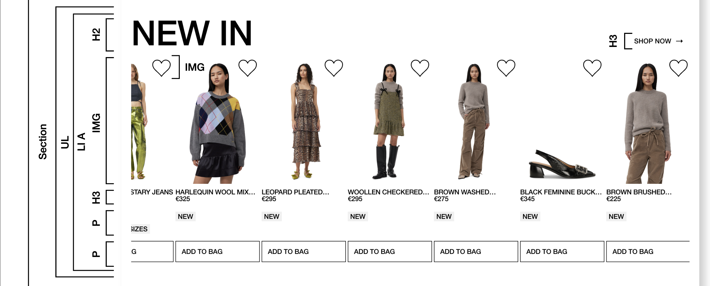

# Procesverslag

Markdown is een simpele manier om HTML te schrijven.  
Markdown cheat cheet: [Hulp bij het schrijven van Markdown](https://github.com/adam-p/markdown-here/wiki/Markdown-Cheatsheet).

Nb. De standaardstructuur en de spartaanse opmaak van de README.md zijn helemaal prima. Het gaat om de inhoud van je procesverslag. Besteedt de tijd voor pracht en praal aan je website.

Nb. Door _open_ toe te voegen aan een _details_ element kun je deze standaard open zetten. Fijn om dat steeds voor de relevante stuk(ken) te doen.

## Jij

  
uitwerken voor kick-off werkgroep

### Auteur:

Abby de Best

#### Je startniveau:

Rood

#### Je focus:

Surface plane (en responsive als ik eraan toekom)

### Je website

  
Uitwerken voor kick-off werkgroep

### Je opdracht:

ganni.com

#### Screenshot(s) van de eerste pagina (small screen):

Ganni home pagina 
 

#### Screenshot(s) van de tweede pagina (small screen):

Product detail pagina 
 

## Toegankelijkheidstest 1/2 (week 1)

  
Uitwerken na test in 2e werkgroep

### Bevindingen

<a href="/readme-images/FED_23-24-Blok2-WCAG checklist.pdf">WCAG test</a>

Lijst met je bevindingen die in de test naar voren kwamen:
<ul>
<li>Veelal de tekst is vaag, zo is er wel alt tekst, maar niet goed beschreven.</li>
<li>De website is best redelijk te gebruiken met een screen reader, maar bijna niet met het toetsenbord.</li>
<li>Horizontaal scrollen kan niet uitgezet worden.</li>
<li>Button en link iconen zijn niet altijd even goed klikbaar op de mobiele site.</li>
<li>Er wordt vaak helemaal geen p of headings gebruikt voor tekst.</li>
<li>H1 wordt meerdere keren op pagina's gebruikt en worden in verkeerde volgorde gebruikt of over geslagen.</li>
<li>Er is alt tekst, maar bevat niet de tekst op of bijbehorend aan de afbeelding, het is vaak nietszeggend en zal niet duidelijk voor blinden.</li>
<li>Decoratieve afbeeldingen bevatten WEL alt tekst.</li>
<li>Media kan niet gepauzeerd worden en heeft geen captions.</li>
<li>Links zijn niet herkenbaar als links, controls hebben geen :focus state en er wordt niet duidelijk gemaakt wanneer een link in een nieuwe tab opent.</li>
<li>Dark mode, high-contrast mode en increased text zijn niet ondersteund.</li>
</ul>

## Breakdownschets (week 1)

  
Uitwerken na afloop 3e werkgroep

### de hele pagina:

  

### dynamisch deel (bijv menu):

  

### wellicht nog een dynamisch deel (bijv filter):

## Voortgang 1 (week 2)

  
Uitwerken voor 1e voortgang

### Stand van zaken

Dit ging goed:
<ul>
  <li>Het meteen structureren van mijn bestanden, tijdens het coderen.</li>
  <li>De flexbox oefeningen gingen me erg makkelijk af, die kennis heb ik goed onthouden van vorig jaar.</li>
  <li>GitHub repositories problemen kunnen oplossen.</li>
</ul>

Ordenen van mijn code bestanden met opvallende emoji's

Dit was lastig:
<ul>
  <li>Mijn kennis van coderen was/is erg weggezakt. Op gang komen was hierdoor ook erg moeilijk.</li>
  <li>Verder had ik eigenlijk alleen maar kleine en praktische vragen die ik heb gesteld of opgezocht.</li>
</ul>

Bij de eerste les had en een menu gemaakt bestaande uit meerdere unordered lists. Na feedback en mijn uitleg dat ik dit handiger kon indelen om te bereiken wat ik wilde, werd me aangeraden unordered lists te nesten in de li van een unordered list(zie screenshot hieronder). Hierna wilde ik een deel van de list items, met daarin een ul, graag verbergen wanneer het scherm smal is. Om dit te doen heb ik het @media attribuut gebruikt. Wanneer ik de li probeerde te selecteren door nav ul li verdwenen niet alle items die ik wilde. Uiteindelijk heb ik dit opgelost door de directe kinderen van de ul te selecteren in @media met >. 

### Agenda voor meeting

Vragen:
<ul>
  <li>Hoe menu beter/handiger indelen?</li>
  <li>Hoe ook alweer typografie op hele bestand toepassen?</li>
  <li>Hoe ook alweer geen margin en padding op hele bestand toepasseen?</li>
</ul>

### Verslag van meeting

## Voortgang 2 (week 3)

  
uitwerken voor 2e voortgang

### Stand van zaken

Dit ging goed:
<ul>
  <li>Het toevoegen van de rest van de html ging best snel en mijn website was daardoor snel gevuld</li>
  <li>Het toepassen van grid ging me vrij makkelijk af.</li>
</ul>

Het toepassen van grid op de 'banner'.

Het beginnen aan de carousel.

De paragraphs die extra info geven aan een product in de carousels.

Shop now met pijltje icoon selecteren met .shop, de svg kleur veranderen van zwart naar wit met filter zodat deze zichtbaar is op de achtergrond.

In de foto gallery de links positioneren met position relative en absolute.

Het opdelen van de footer in een ul met li's met daarin weer een ul, li en a

Dit was lastig:
<ul>
  <li>Het werkend maken van de carousel met navigatie buttons</li>
  <li>Carousel in het gallery deel van de website dezelfde opmaak geven.</li>
</ul>

Uiteindelijk heb ik bij de 'Shop now stukjes met pijltjes iconen' de section waarin ze stonden weggehaald. Ik had deze als 'wrapper' gebruikt, maar was eigenlijk overbodig omdat deze geen functie had. Ik heb de ombattende a kunnen gebruiken als wrapper, hierdoor was ook de grootte van de iconen hierbinnen makkelijker aan te passen.

Online kon ik niet vinden hoe ik op een simpele manier een carousel kon maken met navigatie buttons met html, css, en javascript. Ik had mijn docent om een manier gevraagd en hij tekende het volgende tijdens de les:

Tijdens de les begreep ik het helemaal, alleen toen ik er eenmaal thuis mee aan de slag ging wist ik niet meer hoe het moest en zag ik het niet meer. 😂🥲😅

Ik heb in de section 'gallery' een zelfde carousel gezet. Deze nam alleen niet dezelfde opmaak aan als de eerste carousel omdat hij nog in een section staat. Uiteindelijk heb ik deze tweede carousel opnieuw en spicifieker geselecteerd en dezelfde CSS opmaak gegeven.

### Agenda voor meeting

### Verslag van meeting

## Toegankelijkheidstest 2/2 (week 4)

  
uitwerken na test in 9e werkgroep

### Bevindingen

Lijst met je bevindingen die in de test naar voren kwamen (geef ook aan wat er verbeterd is):

## Voortgang 3 (week 4)

  
uitwerken voor 3e voortgang

### Stand van zaken

Dit ging goed:
<ul>
  <li>Het maken van de ticker en animatie ging makkelijker dan gedacht.</li>
  <li>Ik dacht eerst dat het menu werkend maken met javascript best moeilijk zal worden, alleen was dit best makkelijk met mijn eerder gemaakte website als voorbeeld.</li>
</ul>

Het maken van een ticker met een animatie en @keyframes.

Het menu laten uitklappen wanneer er op het hamburger icoon wordt geklikt. Als voorbeeld heb ik een eerder <a href="/readme-images/rebelride copy.js">javascript bestand</a> van mijzelf gebruikt.

Dit was lastig:
<ul>
  <li>Search bar werkend maken.</li>
  <li>Hartjes button van carousel in gallery deel website zichtbaar krijgen.</li>
</ul>

De hartjes button in de carousel in de gallery hetzelfde zichtbaar krijgen was erg moeilijk. Na talloze dingen aanpassen bleek het de positie van een ander article te zijn of een dubbele position: relative.

Het laten uitklappen van de search bar heb ik op dezelfde manier als het menu aangepakt. Het lukte alsmaar niet om deze werkend te krijgen en ik begreep niet waarom, ik dacht dat ik het element, de searchbar, niet goed geselecteerd had in de JS, waardoor ik uiteindelijk maar een class erop heb gezet om het super specifiek te maken. Dit verbeterde iets, maar toen zelfs dit het niet deed begreep ik het niet meer. Uiteindelijk kwam ik erachter dat ik simpelweg de class zelf nog niet op de searchbar in de html had gezet.🤦🏼‍♀️

### Agenda voor meeting

### Verslag van meeting

## Eindgesprek (week 5)

  
uitwerken voor eindgesprek

### Je uitkomst - karakteristiek screenshots:

  

### Dit ging goed/Heb ik geleerd:

Korte omschrijving met plaatjes

  

### Dit was lastig/Is niet gelukt:

Korte omschrijving met plaatjes
Werkend maken van de carousel is niet gelukt, maar wil ik zeker nog voor elkaar krijgen.

## Bronnenlijst

1. <a href="https://css-tricks.com/snippets/css/complete-guide-grid/">https://css-tricks.com/snippets/css/complete-guide-grid/</a>
2. <a href="https://css-tricks.com/css-only-carousel/">https://css-tricks.com/css-only-carousel/</a>
3. <a href="https://www.w3schools.com/tags/tag_select.asp#:~:text=The%20element%20is%20used,down%20list%20will%20be%20submitted).">https://www.w3schools.com/tags/tag_select.asp#:~:text=The%20element%20is%20used,down%20list%20will%20be%20submitted</a>
4. <a href="https://stackoverflow.com/questions/12875911/how-can-i-make-my-input-type-submit-an-image">https://stackoverflow.com/questions/12875911/how-can-i-make-my-input-type-submit-an-image</a>
5. <a href="https://websitemaintenance.medium.com/create-a-news-ticker-using-html-and-css-quick-guide-fca4fbf872dd">https://websitemaintenance.medium.com/create-a-news-ticker-using-html-and-css-quick-guide-fca4fbf872dd</a>
6. <a href="https://www.w3schools.com/html/html_forms.asp">https://www.w3schools.com/html/html_forms.asp</a>
7. <a href="https://stackoverflow.com/questions/3397113/how-to-remove-focus-border-outline-around-text-input-boxes-chrome">https://nekocalc.com/px-to-rem-converter</a>
8. <a href="https://nekocalc.com/px-to-rem-converter">https://stackoverflow.com/questions/3397113/how-to-remove-focus-border-outline-around-text-input-boxes-chrome</a>
9. <a href="https://blog.logrocket.com/hide-scrollbar-without-impacting-scrolling-css/">https://blog.logrocket.com/hide-scrollbar-without-impacting-scrolling-css/</a>
10. <a href="https://developer.mozilla.org/en-US/docs/Web/Accessibility/ARIA/Attributes/aria-label">https://developer.mozilla.org/en-US/docs/Web/Accessibility/ARIA/Attributes/aria-label</a>
11. <a href="https://developer.mozilla.org/en-US/docs/Web/HTML/Element/input/search">https://developer.mozilla.org/en-US/docs/Web/HTML/Element/input/search</a>

